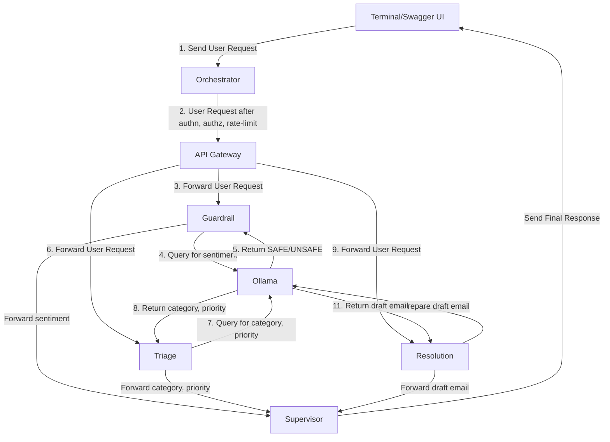

Case Study: ACES (A Customer Escalation System) - A Distributed Service Implementation 

ACES is a simple AI based Customer Escalation System. It takes a customer escalation request, uses sentiment analysis to check for toxicity/safety, identifies the type and priority of the request, drafts an initial response and returns it to the customer. 
ACES is built as a near-production quality distributed service, with containerized microservices that are resilient to crashes, an API-gateway based architecture, and with security features like Rate Limiting, Authentication, and Authorization.
The primary goal of this project was to learn system development, while developing a useful tool using AI.  

Note: the entire implementation was done on my Apple Mac (M4, 16 GB).

Architecture and Tech Stack

System Architecture and Evolution
The architecture of ACES went through multiple iterations as it morphed from the initial monolith implementation to a full distributed service. Following are the key architectural stages.
Monolith: All services implemented as functions in a monolith. Ollama running independently. 
Microservices: Each service separated into its own FastAPI microservice, accessible through HTTP endpoints, reachable at <localhost:port num>. Orchestration through LangGraph. Completely non-blocking design using FastAPI’s async/await features. Ollama running independently. 
Containerization: Each microservice separated into its own Docker container using Docker Compose. Only one service exposing port on localhost, rest connecting over docker’s private IP network. Ollama continues to run uncontainerized on the Mac, reachable at <localhost: 11434>. 
Security: Added Rate Limiting (per-IP and total), userid/password/bearer tokens based Authentication, and  Role based authorisation (RBAC).  
Tech Stack
Python, LangGraph, Ollama, FastAPI, Docker, Docker Compose, Pydantic, SlowAPI, OAuth2.0, JWT (JSON Web Token), curl, Swagger UI

Architecture Diagram
The following diagram illustrates the final system architecture. 

Application Layer
This section details the application layer for the final architecture.

Core Model/Backend
ACES uses the Llama3 model from Ollama. 
It is built with 6 microservices. 

Orchestrator
The orchestrator implements the following:
Defines and builds the LangGraph workflow.
IP-based and total rate limiting for the HTTP endpoints using slowapi.
Authentication with userid/password using a mock user database. Supports bearer tokens using JWT. 
Role based Authorization using the mock user database.
The /process_ticket POST endpoint, which is the primary entry point for ACES. This method invokes the LangGraph workflow.
The /health GET endpoint for automated health checks.
Other endpoints to test authentication and authorization
Exposes port 8000 for public access

API Gateway
Implements the following:
The /submit_ticket POST endpoint which is the entry point for the LangGraph workflow.
Not a true API Gateway.

Guardrail
Invokes the LLM to check the user request for toxicity, abuse, or prompt injection. Returns either SAFE or UNSAFE.
Triage
Analyses the user support issue using the LLM and identifies category (billing, technical, or general) and priority (high, medium, or low).
Resolution
Invokes the LLM to write a draft response: a concise and polite email reply addressing the customer issue.
Supervisor
Checks the SAFE/UNSAFE status from the Guardrail service. If UNSAFE, deletes the draft response from the Resolution service. If SAFE, creates a ticket with the identified category, priority, and user request, and commits it to a database.
Supervisor is the END node of the LangGraph workflow.
All microservices support a /health GET endpoint for automated health checks. 
The choice of tools, particularly the LLM model was dictated by the requirement to run everything on my Apple laptop (M4, 16 GB) without the need for paid APIs on the Cloud.
UI/Frontend 
ACES does not support a UI. Test and Execution are done using ‘curl’ commands from the Mac terminal or from within the containers. Some testing was done using Swagger UI, an interactive testing interface provided by FastAPI.

Data Pipeline 
The data pipeline for ACES is implemented using the LangGraph workflow defined in Orchestrator, visualised in the architecture diagram above.
The orchestrator receives a login request from the user through terminal/Swagger UI. It authenticates the user against its mock database and returns a JWT to the user. It does JWT based authentication and role-based authorisation for subsequent HTTP calls. If successful, it checks if the call is within the defined rate-limits. If yes, it passes the request to the API Gateway. 
The API Gateway takes the user request and passes it in parallel to the Guardrail, Triage, and Resolution services.
Each of these services invokes the LLM to generate its output. Guardrail identifies if the user request is safe to process, Triage identifies the correct category and priority, and Resolution drafts an email that can be sent back to the user. All responses are sent to the supervisor service in parallel.
Supervisor checks if the request is SAFE, creates a ticket with the identified category, priority, and user request, and logs it in a database. It also sends the draft response back to the user.
If the request is UNSAFE, it deletes the draft email, logs the information into a database, but does not create a ticket.

System Infrastructure
ACES implements most of the features required of a production quality distributed service. 
Clean separation of functionality into independent microservices, providing scalability.
State is safely and efficiently passed between microservices using LangGraphs’s shared memory state. 
LangGraph makes orchestration with forks and joins easy. Supports complex workflows with loops, if needed in future.
Using Docker eliminates the “works on my machine problem”. Provides portability. 
Docker Compose makes it easy to manage, connect, and run multiple containers as a unified multi-container application. Provides reliability by restarting containers automatically. 
Exposing only one service to the outside world improves the security posture of the distributed service. Other services stay hidden and safe. Allows for a centralised security architecture.
Using rate limiting at the orchestrator ensure that all services are protected from DOS attacks. Similarly, authentication and authorisation at the orchestrator ensures none of the services can be accessed without proper credentials.

Future work would involve:
Migration to Docker Swarm or Kubernetes to support multi-node clusters, like in real cloud deployments.
Migration to industry standard directories like LDAP (Lightweight Directory Access Protocol) or Active Directory (AD) for authentication and authorisation.
Migration to Redis for storing rate limiter state, to support multi-node implementation.

Engineering Impact

Outcomes 
Created a near production quality distributed service, with industry standard tools. The design of ACES provides a blueprint that can be easily extended to any problem, quickly creating a distributed service that can be deployed in the cloud. 

Key Takeaways
I have 2 key takeaways from this project.
Creating a production quality distributed service requires careful consideration regarding scalability, reliability, portability, and security. Industry standard tools provide support for addressing these requirements.
A good system architecture is a key requirement for a production quality service. It can simplify the design, e.g. choosing a centralised security architecture segregates security constructs to one micro service with other microservices focused on core functionality, while extending security benefits to all microservices.

## Copyright & Licensing

Copyright © 2026 Shubhra Chatterjee. All rights reserved.

The text files, papers, and essays in this repository are the intellectual property of the author. No part of this work may be reproduced, distributed, or transmitted in any form or by any means without prior written permission.

