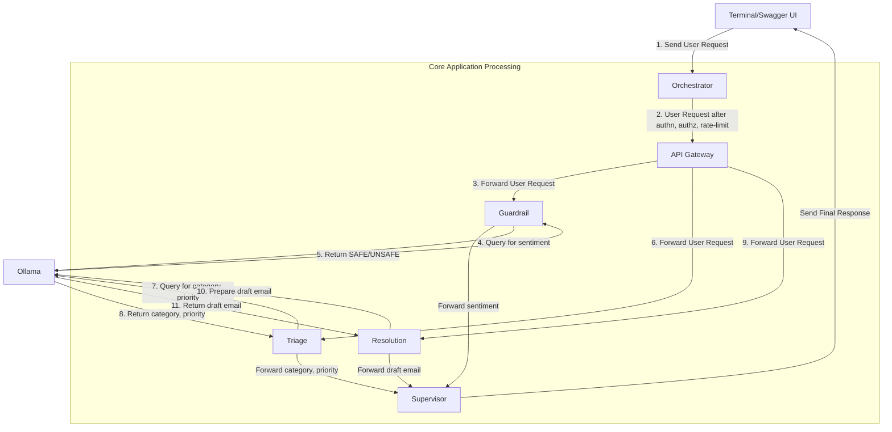

# ACES

```mermaid
graph TD 
A[Terminal/Swagger UI] -->|1. Send User Request|B[Orchestrator] 

subgraph Core Application Processing
    B-->|2. User Request after authn, authz, rate-limit|C[API Gateway]

    %% API Gateway to Guardrail %%
    C-->|3. Forward User Request|D[Guardrail]

    %% API Gateway to Triage %%
    C-->|6. Forward User Request|E[Triage]

    %% API Gateway to Resolution %%
    C-->|9. Forward User Request|F[Resolution]

    %% Send all responses to Supervisor %%
    D-->|Forward sentiment|H[Supervisor]
    E-->|Forward category, priority|H
    F-->|Forward draft email|H
end

%% External Ollama Connections %%
D-->|4. Query for sentiment|G[Ollama]
G-->|5. Return SAFE/UNSAFE|D

E-->|7. Query for category, priority|G
G-->|8. Return category, priority|E

F-->|10. Prepare draft email|G
G-->|11. Return draft email|F

%% Send back Final Response %%
H-->|Send Final Response|A
```
