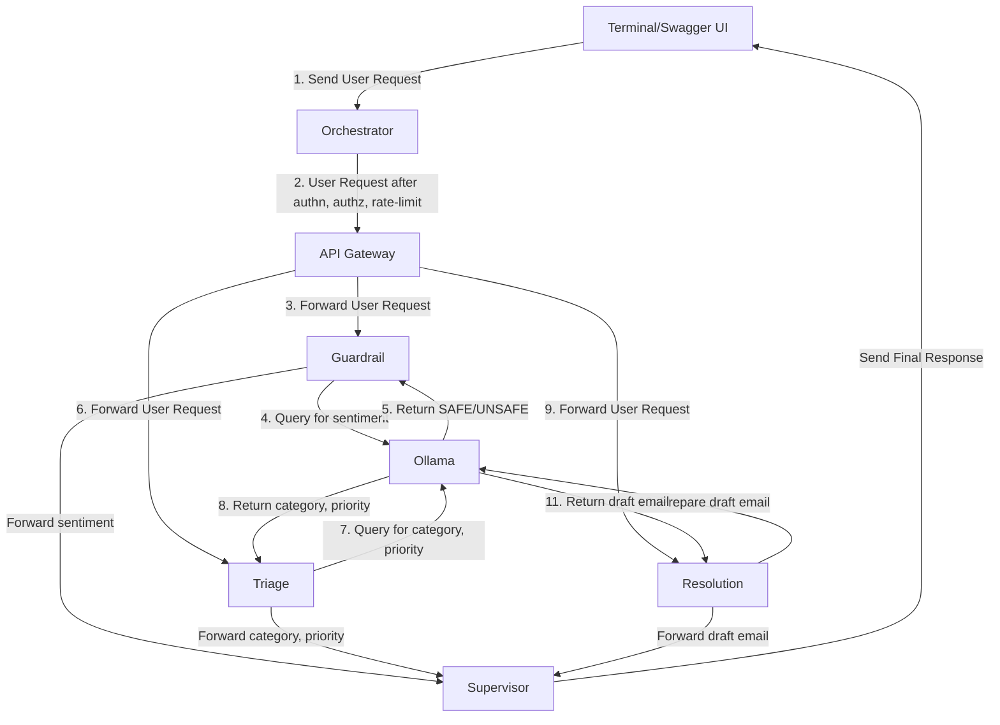

```mermaid
graph TD 
A[Terminal/Swagger UI] -->|1. Send User Request|B[Orchestrator] 

%%  Orchestrator to API Gateway %%
B-->|2. User Request after authn, authz, rate-limit|C[API Gateway]

%% API Gateway to Guardrail to Ollama and back %%
C-->|3. Forward User Request|D[Guardrail]
D-->|4. Query for sentiment|G[Ollama]
G-->|5. Return SAFE/UNSAFE|D

%% API Gateway to Triage to Ollama and back %%
C-->|6. Forward User Request|E[Triage]
E-->|7. Query for category, priority|G
G-->|8. Return category, priority|E

%% API Gateway to Resolution to Ollama and back %%
C-->|9. Forward User Request|F[Resolution]
F-->|10. Prepare draft email|G
G-->|11. Return draft email|F

%% Send all responses to Supervisor %%
D-->|Forward sentiment|H[Supervisor]
E-->|Forward category, priority|H
F-->|Forward draft email|H

%% Send back Final Response %%
H-->|Send Final Response|A
```
